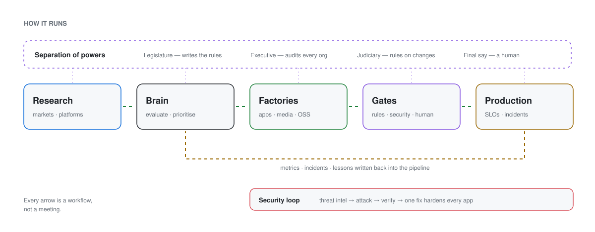

<!--
  v6 (2026-10) — simpler, current. Numbers are from phixi-hub as of 2026-10-04:
  portfolio/apps (113 tracked, 15 status=launched), decisions/ (524 ADRs), 25 GitHub orgs.
  Private work counts in the contribution graph ("Include private contributions" is on).
-->

<picture>
  <source media="(prefers-color-scheme: dark)" srcset="assets/hero-dark.svg">
  
</picture>

  
  
  
  
  

Sydney, Australia · working across Australian and Japanese time zones

---

I run **Phixi as an AI-native company**: the day-to-day work — research, building, shipping, auditing — is done by agents, and people decide where judgement matters. The company is organised as code:

- **25 GitHub organisations, one per function** — research, strategy, security, apps, games, OSS, media … each with its own rules, CI and records. A hub holds the single source of truth and turns findings in one place into proposals for the others.
- **Separation of powers for the agents** — one org writes the rules, one audits every org against them, one judges. No agent can merge a change to the rules on its own, and every rule ends in a human approval.
- **A factory, not a portfolio** — apps are scored, built, launched and retired by a pipeline; what fails is written back into the pipeline instead of into someone's memory.

<picture>
  <source media="(prefers-color-scheme: dark)" srcset="assets/system-dark.svg">
  
</picture>

<picture>
  <source media="(prefers-color-scheme: dark)" srcset="assets/metrics-dark.svg">
  
</picture>

  <a href="https://phixi.co.jp/en/ai">How it works &amp; the stack →</a> ·
  <a href="https://phixi.co.jp/apps">Apps in production →</a> ·
  <a href="https://phixi.co.jp/demo">Try a demo →</a>

### Before Phixi

- **Tech Lead Manager of a 15-person org** at a subscription-commerce SaaS vendor — rebuilt the team, introduced pre-sales, annual engineering MVP for a modular-monolith re-architecture
- **Enterprise identity** — four-company SSO for a ¥100B+ group (Auth0 · Rails · React)
- **Zero-to-one operations system** for an SMB in insurance and car rental — designed, built and still running after three years

---

<b>日本語</b>

 

**Phixi株式会社 代表**。「AIの、AIによる、人のための仕組み」を作っています。

Phixi は **AI ネイティブな会社**として運営しています。調査・開発・公開・監査といった日々の仕事はエージェントが担い、判断が要るところだけを人が決めます。会社そのものをコードとして組んでいます。

- **機能ごとに 25 の GitHub org** — 調査・戦略・セキュリティ・アプリ・ゲーム・OSS・メディアなど。ルール・CI・意思決定の記録を org ごとに持ち、hub が全体の唯一の正本になって、ある場所の発見を他の org への提案に変えます
- **エージェントの三権分立** — ルールを作る org、全 org を監査する org、判定する org を分け、どのエージェントも単独ではルールを変えられません。ルールの最終承認は必ず人です
- **ポートフォリオではなく工場** — アプリは採点・開発・公開・撤退までパイプラインで回し、失敗の教訓は人の記憶ではなくパイプラインに書き戻します

マージした PR **8,767**（直近 30 日 505）・エージェントが実行したタスク **1,795**・CI ワークフロー **452**・意思決定記録 **524**・セキュリティ管理下のシステム **83**・**25** org（2026-10 時点）

仕組みと技術スタックの詳細 → [phixi.co.jp/ai](https://phixi.co.jp/ai) ・ 稼働中のアプリ → [phixi.co.jp/apps](https://phixi.co.jp/apps) ・ デモ → [phixi.co.jp/demo](https://phixi.co.jp/demo)

それ以前は、サブスク EC の SaaS 企業で 15 名組織のテックリードマネージャー（モジュラーモノリス化で年間 MVP）、売上 1,000 億円超の企業グループの 4 社 SSO 統合、保険代理店・レンタカー業の業務システムのゼロイチ開発（3 年経った今も稼働中）など。

[phixi.co.jp](https://phixi.co.jp/) ・ [LinkedIn](https://www.linkedin.com/in/keitaro-kaneko/) ・ [X](https://x.com/keitarokaneko) ・ [japavilion.com](https://japavilion.com/ja/jap/top)（個人の開発・支援）

拠点：シドニー（オーストラリアと日本の両方の時間帯で稼働）

