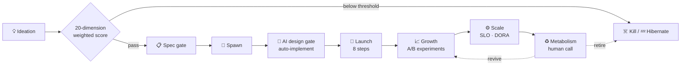
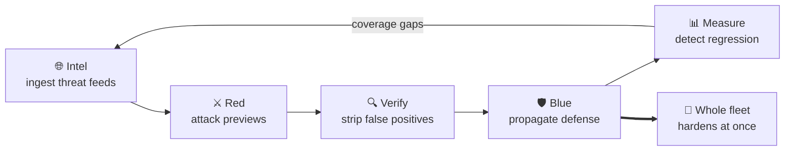
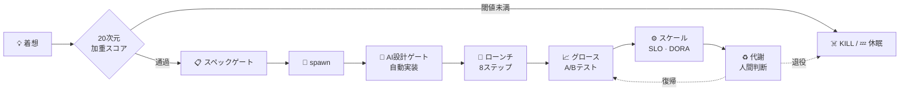
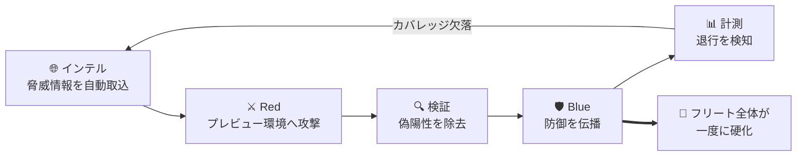

<!--
  v5 — bilingual (EN + JP), calm green (#2ea043).
  Client/employer names withheld; engagement scale (revenue tiers) disclosed.
  Phixi Inc. disclosed (own company, phixi.co.jp). Fleet numbers sourced from
  phixi-hub/portfolio/apps as of 2026-08: 107 tracked / 53 built to MVP+ / 16 launched.
  Activity: GitHub renders the native contribution calendar below this README.
  "Include private contributions on my profile" is enabled, so private work is counted there.
-->

<a href="#english">English</a> | <a href="#japanese">日本語</a>

<h1 id="english" align="center">Keitaro Kaneko</h1>

  <b>Founder / CEO / CTO — <a href="https://phixi.co.jp/">Phixi Inc.</a></b> 
  <b>Full-stack Engineer · Tech Lead · Project Manager</b> 
  Rails / TypeScript / React / AWS — 8+ years in production, from enterprise SaaS to zero-to-one systems.

  
  
  
  

  <b>107</b> apps in an automated pipeline · <b>16</b> live in production · <b>440</b> ADRs · led a <b>15-person</b> org · <b>8+ years</b> shipping production software

  <b>Open to</b> — system development · technical advisory &amp; team design · partnerships 
  <a href="https://phixi.co.jp/">phixi.co.jp</a> · <a href="https://japavilion.com/ja/jap/top">japavilion.com</a>

---

### 👋 About

Founder and CEO/CTO of **[Phixi Inc.](https://phixi.co.jp/)** (Tokyo, est. Nov 2025) — we build, run, and maintain operational systems for businesses, and I run an **autonomous application factory** as the engine behind it.

Alongside that I work as a freelance full-stack engineer — **1.5+ years independent**, supporting **10+ companies** from Figma wireframes to AWS infrastructure, leading both the code and the people around it. Based in **Sydney**, working across Australian and Japanese time zones.

Before going independent I spent 5 years at a Japanese subscription-commerce SaaS vendor, progressing from IC to **Tech Lead Manager of a 15-person org** and earning the product division's **annual engineering MVP** for an architecture overhaul. My edge is bridging **business and engineering** — turning ambiguous problems into shipped, maintainable systems.

- 🧩 **Full-stack** — end-to-end: requirements → architecture → implementation → infra → operations
- 🏗️ **Architecture & scale** — modular-monolith design, multi-company SSO, org-wide AWS modernization
- 🧭 **PM / Tech Lead** — enterprise engagements, pre-sales, team rebuilds, zero-to-one delivery
- 🤖 **AI-native delivery** — an agent-driven pipeline that takes an idea to production with humans on the gates

---

### 🏭 Phixi — an autonomous application factory

Phixi runs a fleet of applications through a single automated pipeline. The interesting part is not any one app; it's that **the pipeline itself is the product**, and every lesson it learns is written back into the system rather than into someone's head.

**Scale today** — **107 applications** tracked in the pipeline · **53** built to MVP or beyond · **16** live in production · **440 ADRs** recorded · 3-tier repository architecture (cross-app hub / shared template / per-app repos)

**The pipeline** — 9 phases from ideation to metabolism. Ideas are scored on 20 weighted dimensions and only pass at a threshold; below it they are auto-improved, hibernated, or killed. Hibernation and revival are deliberate human calls.

**Physical enforcement over good intentions** — process rules are executable, not documentation. Commits are blocked unless docs are in sync; every agent task is followed by a bash-level typecheck/lint gate that auto-reverts on failure, so the model cannot skip it; completion gates audit finished work for missing knowledge-base entries and recurrence prevention, then generate their own follow-up tasks.

**Compounding loops** — three of them run continuously:
- **Delivery** — **claude-flow**, my own task queue and parallel worker orchestrator for Claude Code: FIFO priority queue, git-worktree isolation, DAG dependencies, remote SSH runners, failure snapshots auto-classified into 7 categories, and conflict-avoidance that makes overlapping tasks wait on each other
- **Security** — a purple-team flywheel, below: attack and defense run as one closed loop, so **a single proven defense hardens the whole fleet at once**
- **Decision quality** — a decision-intelligence flywheel: the fleet's own decision logs train models that score future decisions, with prompt rubrics tuned automatically and divergence held under a target

**Shared substrate** — an in-house design system (MECE 3×3 cluster tokens), an AI cost/quality kit (model tiering, prompt-cache conventions, per-call cost accounting), a shared ingestion/browser toolkit published to internal registries, and a knowledge base searchable by BM25 and by vector+graph retrieval.

---

### 🛠️ Tech

**Core stack** — TypeScript · Ruby on Rails · React / Next.js · PostgreSQL · AWS

| Layer | Stack |
| :--- | :--- |
| **Frontend** | React · Next.js · Vue / Nuxt · Redux · Tailwind CSS · Figma |
| **Backend** | Ruby on Rails · Django · Node.js · Laravel · Sidekiq |
| **Data** | PostgreSQL · MySQL · Redis · Elasticsearch · BigQuery · Neon · pgvector |
| **Cloud / Infra** | AWS (ECS/Fargate · Aurora · Lambda · SQS · Step Functions) · GCP · Cloudflare Workers · Vercel · Docker · Terraform |
| **AI / Agents** | Claude Code · Anthropic API · prompt caching &amp; cost accounting · MCP · DSPy · GraphRAG |
| **Identity / Payments** | Auth0 · OAuth 2.0 · Amazon Cognito · Stripe Connect |
| **Architecture** | Modular monolith (packwerk) · Open Policy Agent · ADR-driven design |
| **DX / CI-CD** | GitHub Actions · CircleCI · Jenkins · Biome · Vitest · Playwright · Storybook · Sentry |

---

### 💼 Selected work

- **Enterprise SaaS customization (PM/PL)** — full lifecycle for top-tier EC retailers (¥1B+ annual revenue), multiple concurrent engagements
- **Four-company SSO integration** for a ¥100B+ enterprise — solo-owned identity design on Auth0 + Rails + React
- **Modular-monolith re-architecture** of a branch-exploded flagship SaaS (packwerk) — CTO-sponsored, delivered alongside a concurrent Rails / PostgreSQL uplift; won the division's annual MVP
- **Org-wide AWS modernization** — Aurora v1→v2 zero-downtime upgrade, cost optimization, runbooks
- **15-person team rebuild** as Tech Lead Manager — documentation, onboarding, and investigation playbooks that cleared maintenance bottlenecks; **zero attrition** during final tenure
- **Pre-sales function introduced** to the engineering org — contributed to winning competitive bids in the tens of millions of yen
- **Zero-to-one operations system** (insurance × car-rental, SMB) — 24-month greenfield on Rails + AWS, still shipping features

---

### 💬 Reach me

**[phixi.co.jp](https://phixi.co.jp/)** — Phixi Inc. ·
**[japavilion.com](https://japavilion.com/ja/jap/top)** — portfolio & contact ·
[Web dev](https://japavilion.com/ja/dev/top) · [DX support](https://japavilion.com/ja/biz/top) · [Coaching](https://japavilion.com/ja/prs/top)

 

---

<h1 id="japanese" align="center">兼子 馨太郎</h1>

  <b>Founder / CEO / CTO — <a href="https://phixi.co.jp/">Phixi株式会社</a></b> 
  <b>フルスタックエンジニア · テックリード · プロジェクトマネージャー</b> 
  Rails / TypeScript / React / AWS — 本番運用 8 年超。エンタープライズ SaaS からゼロイチ業務システムまで。

  
  
  
  

  自動パイプライン管理下 <b>107アプリ</b> · 本番稼働 <b>16</b> · ADR <b>440本</b> · <b>15名組織</b>のリード経験 · 本番運用 <b>8年超</b>

  <b>ご相談ください</b> — 業務システム開発 · 技術顧問 / 開発体制の設計 · 協業 
  <a href="https://phixi.co.jp/">phixi.co.jp</a> · <a href="https://japavilion.com/ja/jap/top">japavilion.com</a>

---

### 👋 概要

**[Phixi株式会社](https://phixi.co.jp/)**（東京・2025年11月設立）の Founder 兼 CEO / CTO。企業の業務システムの開発・運用・保守を手がけ、その裏側で**アプリケーションの全自動量産パイプライン**を自社基盤として運用しています。

並行してフリーランスのフルスタックエンジニアとして活動。**独立から約1.5年**で **10社以上**を支援し、Figma のワイヤーフレームから AWS インフラまでスタック全体で本番コードを書き、コードと「人・プロジェクト」の両方をリードします。拠点は**シドニー**、豪・日の両タイムゾーンで稼働しています。

独立前はサブスクリプションコマース SaaS ベンダーで5年、IC から **15名組織のテックリード・マネージャー** へ昇進し、アーキテクチャ刷新で**製品開発部の年間MVP**を受賞。強みは **ビジネスとエンジニアリングの橋渡し** — 曖昧な課題を、動いて保守できるシステムに変えることです。

- 🧩 **フルスタック** — 要件定義 → 設計 → 実装 → インフラ → 運用まで一貫
- 🏗️ **アーキテクチャ / スケール** — モジュラーモノリス設計、複数社SSO、全社AWS刷新
- 🧭 **PM / テックリード** — エンタープライズ案件、プリセールス、組織再建、ゼロイチ
- 🤖 **AI ネイティブ開発** — アイデアから本番までをエージェントが通し、人間はゲートに立つパイプライン

---

### 🏭 Phixi — 全自動アプリケーション量産パイプライン

Phixi は、単一の自動パイプラインでアプリ群（フリート）を回しています。面白いのは個々のアプリではなく、**パイプラインそのものが製品**であり、そこで得た学びが誰かの頭の中ではなく**システム側に書き戻される**ことです。

**現在の規模** — パイプライン管理下 **107アプリ** · うち **53** が MVP 以上まで構築 · **16** が本番稼働中 · **ADR 440本** · 3層リポジトリ構成（横断ハブ / 共通テンプレート / 各アプリ）

**パイプライン** — 着想から代謝まで9フェーズ。アイデアは20次元の加重スコアで評価され、閾値を超えたものだけが通過します。届かなければ自動改善・休眠・KILL。休眠と復帰は人間が意図をもって判断します。

**「気をつける」ではなく物理強制** — プロセス規約をドキュメントではなく実行可能な形にしています。ドキュメントが同期していなければコミットは通りません。エージェントのタスク完了後には bash レベルの typecheck / lint ゲートが走り、失敗すれば直前のコミットを自動 revert します（**モデル側からはスキップできない**）。完了ゲートは終わったタスクをナレッジベース登録漏れ・再発防止策の不在という観点で監査し、必要なら自分でフォローアップタスクを起票します。

**複利で効く3つのループ** — 常時稼働しています:
- **デリバリー** — 自作の **claude-flow**（Claude Code 用のタスクキュー兼並列ワーカーオーケストレータ）。優先度付き FIFO キュー、git worktree 分離、DAG 依存、リモート SSH ランナー、失敗時のスナップショットを7カテゴリに自動分類、同じファイルに触るタスクを自動で待たせるコンフリクト回避
- **セキュリティ** — パープルチームのフライホイール（下図）。攻撃と防御を1つの閉ループとして回すことで、**実証された防御ひとつがフリート全体を一度に硬化**させます
- **意思決定品質** — ディシジョン・インテリジェンスのフライホイール。フリート自身の意思決定ログでモデルを訓練し、以後の判断をスコアリング。プロンプトのルーブリックは自動チューニングされ、乖離率を目標値以下に維持

**共通基盤** — 自社デザインシステム（MECE 3×3 クラスタトークン）、AI コスト/品質キット（モデル階層・プロンプトキャッシュ規約・呼び出し単位のコスト計上）、社内レジストリに publish した共通 ingestion / browser ツールキット、BM25 と vector+graph 検索の両方で引けるナレッジベース。

---

### 🛠️ 技術スタック

**主戦場** — TypeScript · Ruby on Rails · React / Next.js · PostgreSQL · AWS

| レイヤ | スタック |
| :--- | :--- |
| **フロントエンド** | React · Next.js · Vue / Nuxt · Redux · Tailwind CSS · Figma |
| **バックエンド** | Ruby on Rails · Django · Node.js · Laravel · Sidekiq |
| **データ** | PostgreSQL · MySQL · Redis · Elasticsearch · BigQuery · Neon · pgvector |
| **クラウド / インフラ** | AWS (ECS/Fargate · Aurora · Lambda · SQS · Step Functions) · GCP · Cloudflare Workers · Vercel · Docker · Terraform |
| **AI / エージェント** | Claude Code · Anthropic API · プロンプトキャッシュ / コスト計測 · MCP · DSPy · GraphRAG |
| **認証 / 決済** | Auth0 · OAuth 2.0 · Amazon Cognito · Stripe Connect |
| **アーキテクチャ** | モジュラーモノリス（packwerk）· Open Policy Agent · ADR 駆動設計 |
| **DX / CI-CD** | GitHub Actions · CircleCI · Jenkins · Biome · Vitest · Playwright · Storybook · Sentry |

---

### 💼 主な実績

- **エンタープライズ SaaS カスタマイズ（PM/PL）** — 年商10億円+ の大手EC事業者向けに要件〜運用まで、複数同時並行で推進
- **4社間 SSO 統合** — 年商数千億円規模企業の認証設計・実装を単独主導（Auth0 + Rails + React）
- **モジュラーモノリス化** — ブランチ乱立した主力SaaSを packwerk で再設計。CTO直下案件、Rails / PostgreSQL バージョンアップと並行推進し**製品開発部 年間MVP 受賞**
- **全社 AWS 刷新** — Aurora v1→v2 無停止アップグレード、コスト最適化、運用整備
- **15名チーム再構築**（テックリード・マネージャー）— ドキュメント / オンボーディング / 調査プレイブックを整備し保守ボトルネックを解消。最終期の**離職ゼロ**
- **プリセールス機能を開発組織に導入** — 数千万円規模の競合コンペ勝利に貢献
- **ゼロイチ業務システム**（保険×レンタカー・中小企業）— 24ヶ月グリーンフィールド、現在も追加開発継続

---

### 💬 連絡先

**[phixi.co.jp](https://phixi.co.jp/)** — Phixi株式会社 ·
**[japavilion.com](https://japavilion.com/ja/jap/top)** — ポートフォリオ / お問い合わせ ·
[Web開発](https://japavilion.com/ja/dev/top) · [DX支援](https://japavilion.com/ja/biz/top) · [コーチング](https://japavilion.com/ja/prs/top)

---

Most production work lives in private client and team repositories — the graph below counts it, but the code stays there. 
本番案件の多くは顧客・チームの private リポジトリで進行しています。下のグラフには計上されますが、コード自体は非公開です。

